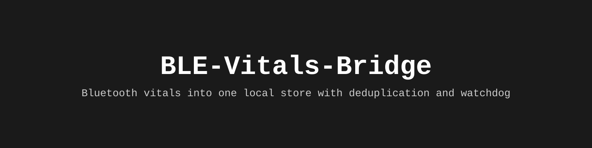

# BLE-Vitals-Bridge

_Русская версия: [README.ru.md](README.ru.md)_

**Three home devices, one local file — and a watchdog that notices when one of them goes quiet.**

[](LICENSE)
[](.github/workflows/tests.yml)
[](https://pypi.org/project/ble-vitals-bridge/)
[](https://pypi.org/project/ble-vitals-bridge/)

<div align="center">

</div>

---

## Overview

BLE-Vitals-Bridge consolidates vital measurements from multiple Bluetooth Low Energy devices into a unified local store. The package reads blood-pressure cuffs, scales, and glucose sensors over standard Bluetooth services, parses frames according to ISO/IEEE 11073 specifications, and maintains a deduplicated SQLite database with configurable watchdog rules.

## Architecture

The data flow follows this sequence:
1. **Input**: BLE devices or JSONL imports
2. **Frame parsing**: ISO 11073 SFLOAT handling and unit detection
3. **Normalization**: Unit conversion (kg/lb, mmHg, mg/dL)
4. **Deduplication**: Key-based removal of repeated measurements
5. **Storage**: SQLite database with primary key constraints
6. **Watchdog**: Frequency monitoring and silence detection
7. **Export**: CSV output and status reporting

## Data Format

### Metrics and Fields

| Metric Type | Units | Deduplication Key | Notes |
|-------------|-------|------------------|-------|
| `weight` | kg | `source|metric|taken_at|value` | Imperial flag preserved in raw frame |
| `systolic` | mmHg | `source|metric|taken_at|value` | Parsed from SFLOAT values |
| `diastolic` | mmHg | `source|metric|taken_at|value` | Parsed from SFLOAT values |
| `pulse` | bpm | `source|metric|taken_at|value` | From BP or CGM frames |
| `glucose` | mg/dL | `source|metric|taken_at|value` | Continuous sensor values |

### Database Schema

| Column | Description |
|--------|-------------|
| `dedupe_key` | Primary key: `source|metric|taken_at|value` |
| `metric`, `value`, `unit` | Raw measurement in original units |
| `taken_at` | Device timestamp normalized to local time |
| `source`, `device` | Origin identifier and device address |
| `group_id` | Links related metrics (systolic/diastolic/pulse) |
| `raw` | Full parsed frame in JSON format |

## Features

- **Standard Bluetooth Services**: Supports Blood Pressure (`0x1810`), Weight Measurement (`0x2A9D`), Body Composition (`0x2A9C`)
- **SFLOAT Parsing**: Handles IEEE 11073 SFLOAT values with proper mantissa/exponent extraction
- **Unit Detection**: Automatic imperial/metric conversion based on flag bits
- **Idempotent Operations**: Import and watch commands prevent duplicate storage
- **Silence Detection**: Configurable watchdog monitors expected measurement frequencies
- **Local Storage**: Single SQLite file accessible across machines
- **CLI Interface**: Command-line tools for import, watch, export, and status

## Quick Start

```sh
pip install "ble-vitals-bridge[ble]"    # Includes bleak for BLE connectivity
bridge import ~/logs/scale.jsonl        # Import existing JSONL logs safely
bridge watch cuff                       # Wait for and store a single measurement
bridge status                           # Show latest readings and detect silence
bridge status --quiet                   # Exit code 1 if source is silent
bridge export --metric weight --days 90 > weight.csv
```

## Installation

Install the core package with optional extras for BLE functionality:

```sh
pip install ble-vitals-bridge           # Core functionality only
pip install "ble-vitals-bridge[ble]"    # Adds BLE connectivity via bleak
pip install "ble-vitals-bridge[dev]"    # Development dependencies (pytest, ruff)
```

The BLE functionality requires proper permissions to access Bluetooth hardware on your system.

## Usage

### Commands

- `bridge watch <device_type>`: Listen for a single measurement from specified device
- `bridge import <path>`: Process JSONL files from previous recordings
- `bridge status`: Report latest readings and watchdog status
- `bridge export --metric <type> --days <n>`: Export CSV data for analysis
- `bridge metrics`: List available metrics in the database

### Exit Codes

- `0`: Success, data available or operation completed normally
- `1`: Error occurred during operation
- `2`: Watchdog detected silent source (when using `--quiet`)

## Outputs/Artifacts

- **SQLite Database**: Default `vitals.db` with deduplicated measurements
- **CSV Exports**: Formatted data for charts, spreadsheets, or medical review
- **Status Reports**: Watchdog notifications indicating missed measurements
- **Raw Frames**: Complete JSON representations of parsed device frames

## Configuration

The watchdog rules are defined in `watchdog.DEFAULT_RULES` and keyed by metric type rather than device. Default expectations:

| Metric | Expected Frequency | Reason |
|--------|-------------------|---------|
| `weight` | Every 14 days | Minimum twice-monthly weigh-ins |
| `systolic` | Every 7 days | Weekly pressure monitoring |
| `glucose` | Every 36 hours | Continuous sensor operational |
| `pulse` | Every 36 hours | Coordinated with glucose readings |

Rules are configurable without code changes when replacing devices.

## Operational Notes

When a device stops transmitting, the watchdog identifies this through frequency analysis. The system distinguishes between:

- **Device silence**: No new measurements within expected timeframe
- **Connection issues**: Temporary BLE communication problems
- **Normal gaps**: Expected intervals based on device usage patterns

Measurement frequencies are tracked per metric type: weight (14-day cycle), blood pressure (7-day), glucose/pulse (36-hour continuous).

## Project Scope

This package addresses the core challenge of consolidating BLE vital measurements without vendor dependencies. It handles the technical complexities of Bluetooth protocols while maintaining a local-first architecture.

## Use Cases

- Personal health data consolidation from multiple BLE devices
- Local backup of measurements before vendor cloud upload
- Research data collection with standardized formats
- Integration with personal health dashboards
- Medical consultation preparation with consistent data

## Limitations

- **Hardware Dependencies**: Requires compatible BLE radio and proper system permissions
- **Protocol Variations**: Bluetooth implementations vary between device manufacturers
- **Live Reading Requirements**: Real-time BLE reading needs `bleak` and system access rights
- **Vendor Lock-in Protocols**: Encrypted or proprietary protocols (like Xiaomi MiBeacon) are unsupported
- **Service Standard Compliance**: Depends on devices implementing standard Bluetooth services

## Repository Layout

```
ble_vitals_bridge/     # Main package with parsers and CLI
├── cli.py             # Command-line interface
├── parser/            # Frame parsing logic
├── db/                # SQLite storage layer
└── watchdog/          # Silence detection logic
tests/                 # Unit tests without hardware requirements
site/                  # Static assets including banner
.github/workflows/     # CI configuration
pyproject.toml         # Package metadata and dependencies
README.md              # English documentation
README.ru.md           # Russian translation
```

## Testing

Run the full test suite without hardware requirements:

```sh
pip install -e ".[dev]"
pytest -q               # 26 tests covering all components
ruff check .
```

Tests include bidirectional frame construction and verification to ensure parser accuracy beyond self-consistency.

## Deployment

The package installs as a command-line tool `bridge` with subcommands for all operations. SQLite database location defaults to `vitals.db` in current directory but is configurable.

## License

MIT — see [LICENSE](LICENSE).

---

## Disclaimer

This software is designed for personal health data management and should not be considered a substitute for professional medical advice, diagnosis, or treatment.
